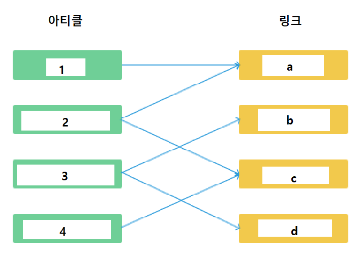

야근하고 11시에 집에서...

- django 프로젝트에 크롤링을 위한 parsed_data 앱을 추가하였다. admin에 parsed_data의 모델을 등록함

- article과 link의 관계를 manytomany로 정의하였고 article이라고하는 class PetitionData(models.Model)에 link 필드가 존재함.



- 함수를 통해 반환된 dict형 데이터를 통해 레코드를 만들고 데이터베이스에 저장하는 코드를 작성하였다.

```
data_obj = PetitionData.objects.create(article_number=petition_data_dict['article_number'],
                                                   progress=petition_data_dict['progress'],
                                                   title=petition_data_dict['title'],
                                                   count=petition_data_dict['count'],
                                                   category=petition_data_dict['category'],
                                                   start=petition_data_dict['start'],
                                                   end=petition_data_dict['end'],
                                                   write=petition_data_dict['write'])
            if petition_data_dict['link']:
                for key, value in petition_data_dict['link'].items():
                    link_obj = PetitionLink.objects.create(link=value)
                    data_obj.link.add(link_obj)
```
create를 사용하면 생성과 저장을 동시에 할 수 있다.
manytomany 혹은 foreign을 생성할 때는 create가 아니라 add를 통해 추가한다.

- 뭔가 에러가 나서 디버그를 해봤는데 write=petition_data_dict['write'] 이 부분에서 에러가 난다.

왜 그럴까 textfield를 써서 그런가...
