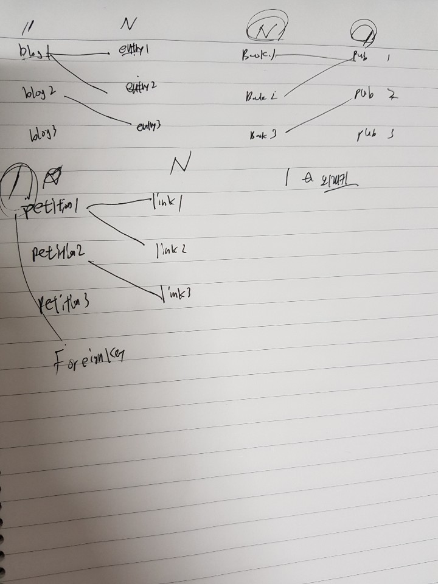

금, 토, 일 푸우욱 쉬었다.

저번 주에 이어 크롤링한 데이터 저장해보자.

데이터베이스 설계를 다시함



article과 link가 있는데, article 하나에 link가 여러개 존재함

이런 경우는 article : link = 1 : N의 관계이므로 article이 외래키가 되어야 함

**1:N의 관계에서 1이 외래키이다.**

many to many에서 참조 관계로 수정함.

- 테스트 코드를 작성하고 실행하면 에러가 났던 이유는 pk를 article_number로 설정했는데 처음 실행할 때는 데이터가 없었으니까 insert되고
다시 수행하면 이미 pk가 있으므로 중복되니까 에러가 났던 것.

- 수집 프로그램이 종료되어도 다시 실행 할 수 있도록 데이터베이스에 저장된 마지막 기사 다음 것 부터 수정하도록 설정함.

```
lastArticle = PetitionData.objects.last().article_number
sleep(10)
for i in range(lastArticle+1, 489302):
```

- 수집하고 싶은 날짜 설정 기능, article과 link의 관계를 manytomany에서 foreignkey 관계롤 수정한 코드는 다음과 같다.
```
for i in range(lastArticle+1, 489302):
    petition_data_dict = petition_crawling(i)
    if petition_data_dict:
        # 수집하고 싶은 날짜 이후의 데이터만 저장합니다.
        start_date = datetime.datetime(2018, 11, 30)
        end_date = datetime.datetime(2019, 1, 1)
        petition_date = datetime.datetime.strptime(petition_data_dict['start'], '%Y-%m-%d')
        if start_date < petition_date < end_date:
            data_obj = PetitionData.objects.create(article_number=petition_data_dict['article_number'],
                                                   progress=petition_data_dict['progress'],
                                                   title=petition_data_dict['title'],
                                                   count=petition_data_dict['count'],
                                                   category=petition_data_dict['category'],
                                                   start=datetime.datetime.strptime(petition_data_dict['start'],
                                                                                    '%Y-%m-%d'),
                                                   end=datetime.datetime.strptime(petition_data_dict['end'],
                                                                                  '%Y-%m-%d'),
                                                   write=petition_data_dict['write'])
            if petition_data_dict['link']:
                for key, value in petition_data_dict['link'].items():
                    link_obj = PetitionLink(link=value)
                    link_obj.petition_article = data_obj
                    link_obj.save()
            print(str(petition_data_dict['article_number'])+"번이 추가 되었습니다.")
    sleep(15)
```

데이터 수집은 다 했으니까 이 데이터로 게임을 만들어봅시다.