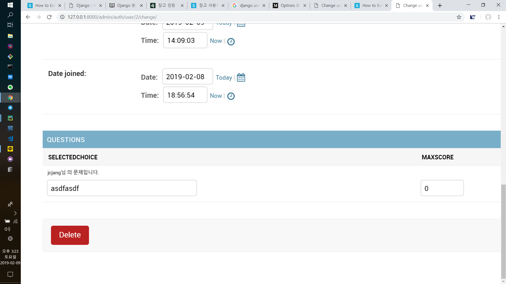

# Django User model extend 하는 가장 쉬운 방법

Django를 이용하면서 가장 편리한 점 중 하나는 Auth 관련된 기능이다.

관리자 페이지도 만들어주고 간단한 User Auth도 간단한 편이다.

나는 개발하던 도중 User field를 추가해야할 일이 생겼다.

그래서 여러가지 글 들을 참고했다.

[Django 공식 문서](https://docs.djangoproject.com/en/2.1/topics/auth/customizing)
에서 크게 두가지를 설명한다.
1. 기존 User model 확장하기
1. Custom User model

나는 첫번째 방법인 **기존 User model 확장하기**를 통해 구현했다.

```buildoutcfg
# djangoapp/models.py
from django.contrib.auth.models import User

class Question(models.Model):
    selectedchoice = models.CharField(max_length=1000)
    maxscore = models.PositiveIntegerField(default=0)
    currentscore = models.PositiveIntegerField(default=0)
    qnumber = models.PositiveIntegerField(default=0)

    user = models.OneToOneField(User, on_delete=models.CASCADE)

    def __str__(self):
        return self.user.username + "님 의 문제입니다."
```

Question model을 생성하고 user를 OneToOneField로 연결했다.


```buildoutcfg
# djangoapp/admin.py
from django.contrib import admin
from django.contrib.auth.admin import UserAdmin as BaseUserAdmin
from django.contrib.auth.models import User

from .models import Petition, Question
# Register your models here.


class QuestionInline(admin.TabularInline):
    model = Question
    can_delete = False
    verbose_name = 'question'


class UserAdmin(BaseUserAdmin):
    inlines = (QuestionInline,)


admin.site.register(Petition)
admin.site.register(Question)
admin.site.unregister(User)
admin.site.register(User, UserAdmin)
```

BaseUserAdmin class를 상속받은 UserAdmin class를 생성하고 user model에서 question model도 같이 볼 수 있게
inlines를 추가했다.

admin.site.register() 함수의 두 번째 인자로 UserAdmin class를 등록하여 admin site에 반영했다.

