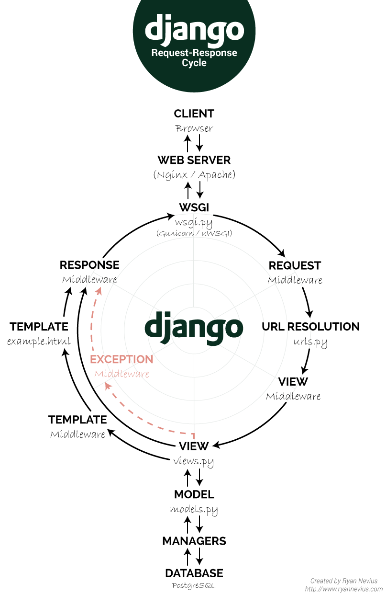

장고를 사용하여 개발을 완료했다면 실제로 서비스하기 위해서는 개발한 프로그램을 운영 환경에 배포하고 실행해야 한다.

개발 환경에서 운영 환경으로 옮겨갈 때 달라지는 점 들이 있다.

달라지는 점을 알아보기 전에 웹 서버 연동 원리에 대해 알아보자.



그림과 같이 클라이언트의 요청 -> 웹 서버 수신 -> WSGI 서버가 처리 위임 -> django 애플리케이션 처리 후 반환의 순서로
진행된다.

웹 서버로는 아파치, nginx등이 있고 예전에는 아파치를 많이 썼지만, 프로세스, 스레드 방식의 처리 때문에 만명이상의 클라이언트 동시접속을 처리하기 힘들어서
이벤트 기반 처리 방식을 사용하는 nginx가 대세이다.

WSGI 서버로는 uwsgi, guicorn과 같은 WAS 서버 프로그램이 있다. 웹 서버와 애플리케이션 사이에 위치하여 uwsgi와 같은 프로그램을 WSGI 규격에서는
미들웨어라고 부른다. 이 책에서는 이것을 WSGI 서버라고 부른다.

마지막으로 django 애플리케이션은 우리가 개발한 파이썬 프로그램이다.

개발할 때는 몰랐지만 이렇게 보면 장고는 결국 **파이썬 웹 애플리케이션**을 만들어주는 **프레임워크**라고 할 수 있다.

그래서 장고로 만든 프로그램은 WAS에서 호출될 수 있도록 **WSGI 규격을 준수**해야하는데, **wsgi.py**파일이 이 역할을 한다.

```
"""
WSGI config for mysite project.

It exposes the WSGI callable as a module-level variable named ``application``.

For more information on this file, see
https://docs.djangoproject.com/en/2.1/howto/deployment/wsgi/
"""

import os

from django.core.wsgi import get_wsgi_application

os.environ.setdefault('DJANGO_SETTINGS_MODULE', 'mysite.settings')

application = get_wsgi_application()

# ~/django.core.wsgi.py 파일 내용 일부에는 get_wsgi_application() 함수가 있다.
def get_wsgi_application():
    return WSGIHandler()
```

wsgi.py파일의 코드는 위와 같다. wsgi 모듈이 실행되면 WSGIHandler 객체가 생성되어 application 변수에 할당된다.

WSGIHandler 객체를 WAS 서버가 호출한다.

**WAS 서버 측면에서 보면** WAS 서버가 장고 애플리케이션의 wsgi.py 파일을 호출하여 WSGIHandler 객체를 얻은 다음에, 
이 객체를 다시 호출하여 최종 응답을 생성하고, 이를 웹 서버에 돌려준다.


>> 정리하면 장고는 웹 애플리케이션을 만들어주는 프레임워크이고, WSGI 규격의 애플리케이션 스펙을 구현하기 위해 wsgi.py 파일을 제공한다.
 