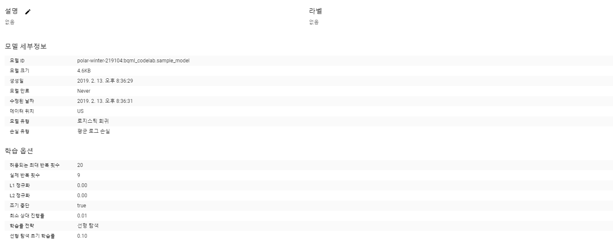

# BigQuery ML 시작하기

# 1. 개요

BigQuery ML을 사용하면 SQL 쿼리를 사용하여 BigQuery에서 기계 학습 모델을 만들고 실행할 수 있습니다.
목표는 SQL 실무자가 기존 도구를 사용하여 모델을 작성하고 데이터 이동의 필요성을 제거하여 개발 속도를
높일 수 있게함으로써 기계 학습을 민주화(?)하는 것입니다.

- 만드는 것:
[sample Analaytics 360 dataset](https://support.google.com/analytics/answer/3437719)을
사용하여 방문자가 거래를 할 것인지 여부를 예측하는 모델을 만들 수 있습니다.

- 배우는 것:
BigQuery에서 기계 학습 모델을 작성, 평가 및 사용하는 방법

# 2. 설치 및 요구사항

이 단계는 생략함 [링크](https://codelabs.developers.google.com/codelabs/bqml-intro/index.html#1)

다만, 계정을 만들면 사용할 수 있는 데이터 셋이 없지만, BigQuery에서 사용할 수 있는 수많은 공개 데이터 셋이 있다.

# 3. 데이터 셋 만들기

뒤에 나올 sql 예제에서 테이블명을 입력하므로 Dataset ID는 bqml_codelab으로 정하는 것을 권장함.

이 단계는 생략함 [링크](https://codelabs.developers.google.com/codelabs/bqml-intro/index.html#2)

# 4. 모델 만들기

**Analytics 360의 로지스틱 회귀 분석**

방문자가 거래를 할 것인지를 예측하는 모델을 만드는 방법은 다음과 같습니다.
```buildoutcfg
#standardSQL
CREATE OR REPLACE MODEL `bqml_codelab.sample_model`
OPTIONS(model_type='logistic_reg') AS
SELECT
    IF(totals.transactions IS NULL, 0, 1) AS label,
    IFNULL(device.operatingSystem, "") AS os,
    device.isMobile AS is_mobile,
    IFNULL(geoNetwork.country, "") AS country,
    IFNULL(totals.pageviews, 0) AS pageviews
FROM
    `bigquery-public-data.google_analytics_sample.ga_sessions_*`
WHERE
    _TABLE_SUFFIX BETWEEN '20160801' AND '20170631'
LIMIT 100000;
```

SQL문 각 절에 대해 알아보겠습니다.

>> CREATE OR REPLACE MODEL 'bqml_codelab.sample_model'
 
"bqml_codelab"은 데이터 집합의 이름이고 "sample_model"은 모델의 이름입니다.

---

>> OPTIONS(model_type='logistic_reg') AS

model_type OPTIONS은 필수입니다.

지정된 모델 유형은 binary logistic regression입니다.

모델 유형은 linear_reg, logistic_reg 이렇게 두가지를 제공합니다. 자세한 옵션 설정은
[링크](https://cloud.google.com/bigquery/docs/reference/standard-sql/bigqueryml-syntax-create#model_name)
에서 확인 가능합니다.

---


조건식 구문
- IF(cond, true_result, else_result)
- IFNULL(expr, null_result)

방문자의 기기 운영체제, 모바일 기기인지의 여부, 방문자 국가 및 페이지 뷰 수를 거래가 이루어 졌는지 여부에 대한 기준으로 사용합니다.

---

FROM 절에 20160801부터 20170631 까지의 테이블의 이름을 모두 지정해야 하는 경우 다음과 같아질겁니다.

```buildoutcfg
FROM (
    SELECT
        *
    FROM
        `bigquery-public-data.google_analytics_sample.ga_sessions_20160801` UNION ALL
    SELECT
        *
    FROM
        `bigquery-public-data.google_analytics_sample.ga_sessions_20160802` UNION ALL
    SELECT
        *
    FROM
        `bigquery-public-data.google_analytics_sample.ga_sessions_20160803` UNION ALL
    SELECT
        *
    FROM
        `bigquery-public-data.google_analytics_sample.ga_sessions_20160804` UNION ALL
        
        ...
```

하지만 와일드 카드 테이블을 사용하면 훨씬 간결해집니다.
```buildoutcfg
FROM
    `bigquery-public-data.google_analytics_sample.ga_sessions_*`
WHERE
    _TABLE_SUFFIX BETWEEN '20160801' AND '20170631'
```

>> WHERE _TABLE_SUFFIX BETWEEN '20160801' AND '20170631'

와일드 카드 테이블을 사용해야 하는 경우는 다음과 같습니다. 자세한 와일드 카드 설정은
[링크](https://cloud.google.com/bigquery/docs/querying-wildcard-tables?hl=ko)
에서 확인 가능합니다.

---

마지막으로 시간을 줄이기 위해 100000개의 데이터로 제한합니다.
```
LIMIT 100000;
```

---

이러한 쿼리를 실행하면 모델이 만들어집니다. 모델 세부정보, 모델 통계, 모델 스키마로 모델에 대한 정보를 확인할 수 있습니다.

**모델 세부 정보**


**모델 통계**


**모델 스키마**


# 5. 모델 평가하기

```buildoutcfg
#standardSQL
SELECT
  *
FROM
  ml.EVALUATE(MODEL `bqml_codelab.sample_model`, (
SELECT
  IF(totals.transactions IS NULL, 0, 1) AS label,
  IFNULL(device.operatingSystem, "") AS os,
  device.isMobile AS is_mobile,
  IFNULL(geoNetwork.country, "") AS country,
  IFNULL(totals.pageviews, 0) AS pageviews
FROM
  `bigquery-public-data.google_analytics_sample.ga_sessions_*`
WHERE
  _TABLE_SUFFIX BETWEEN '20170701' AND '20170801'));
```

4번 모델 만들기에서는 테이블을 만들었다면 이번에는 평가하는 부분이다. ml.evaluate 함수를 사용하여 모델 통계를 평가합니다.

우리는 로지스틱 회귀 모형을 사용했으므로 출력 열은 다음과 같다.
- precision
- recall
- accuracy
- f1_score
- log_loss
- roc_auc

**모델 평가 쿼리 결과**


# 6. 모델 사용

국가별 구매 예상하기

각국 방문객의 거래 건수를 예측하고 구매 수를 기준으로 상위 10개국을 선택합니다.

```buildoutcfg
#standardSQL
SELECT
  country,
  SUM(predicted_label) as total_predicted_purchases
FROM
  ml.PREDICT(MODEL `bqml_codelab.sample_model`, (
SELECT
  IFNULL(device.operatingSystem, "") AS os,
  device.isMobile AS is_mobile,
  IFNULL(totals.pageviews, 0) AS pageviews,
  IFNULL(geoNetwork.country, "") AS country
FROM
  `bigquery-public-data.google_analytics_sample.ga_sessions_*`
WHERE
  _TABLE_SUFFIX BETWEEN '20170701' AND '20170801'))
GROUP BY country
ORDER BY total_predicted_purchases DESC
LIMIT 10;
```
